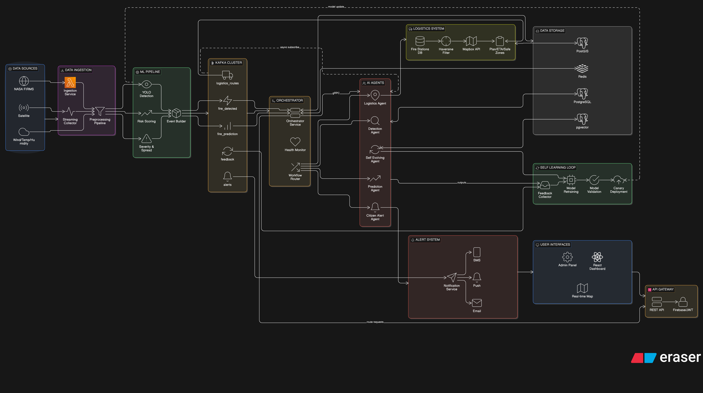

# Blaze-Guard

AI-driven wildfire detection, prediction, logistics routing, and citizen alerting platform built with a microservice architecture.

---

## Overview

Blaze-Guard processes fire-related signals (satellite/event streams + ML outputs), routes decisions through specialized agents, and sends actionable alerts in near real-time.

Core goals:

- Detect potential wildfire incidents
- Predict spread and risk
- Dispatch fastest logistics routes
- Alert citizens and authorities
- Continuously improve model behavior via feedback loops

---

## High-Level Architecture

- **Frontend**: React + TypeScript dashboard
- **API Gateway**: REST entrypoint for clients
- **A2A Agent Layer**:
  - Detection Agent
  - Prediction Agent
  - Logistics Agent
  - Citizen Alert Agent
  - Self-Evolving Agent
- **Orchestrator**:
  - agent registry
  - message routing
  - health monitoring
  - gRPC service
- **Event Bus**: Kafka
- **Data**:
  - PostgreSQL / PostGIS (geospatial logistics)
  - Redis / Redis Cloud (state/cache)
  - pgvector (planned/optional long-term memory use)

---

## Repository Structure

```text
Blaze-Guard/
├── README.md
└── Blazeguard/
    ├── docker-compose.yml
    ├── A2A/
    │   ├── go.mod
    │   ├── agent/
    │   │   ├── detection/
    │   │   ├── prediction/
    │   │   ├── logistics/
    │   │   ├── citizenalert/
    │   │   └── self/
    │   └── shared/
    ├── api-gateway/
    ├── Backend/
    │   └── Auth/
    ├── frontend/
    ├── kafka/
    ├── orchestrator/
    └── MD/
```

---

## Services

## 1) A2A Agents (`Blazeguard/A2A/agent`)
- **Detection**: processes fire detection events
- **Prediction**: spread/risk estimation
- **Logistics**: nearest station query + Mapbox route optimization
- **Citizen Alert**: SMS/Push/Email-style alert flow
- **Self Agent**: quality/feedback monitoring for continuous improvement

## 2) API Gateway (`Blazeguard/api-gateway`)
- REST APIs for frontend/external clients
- CORS + middleware
- Publishes event payloads to Kafka topics

## 3) Orchestrator (`Blazeguard/orchestrator`)
- Agent registry/discovery
- Health monitor
- Routing layer
- gRPC service definitions and server

## 4) Auth Backend (`Blazeguard/Backend/Auth`)
- Authentication and user/session support
- Firebase + database integration

## 5) Frontend (`Blazeguard/frontend`)
- Authority + Citizen views
- Real-time dashboard + map workflows

---

## Event Flow (E2E)

1. Data ingestion / ML generates detection or risk signals  
2. Events published to Kafka (`fire_detected`, `fire_prevention_check`, etc.)  
3. Detection/Prediction agents process and forward context  
4. Logistics agent computes response route:
   - PostGIS nearest station filtering
   - Haversine prefilter (optional)
   - Mapbox shortest/fastest ETA route
5. Citizen Alert agent pushes emergency/prevention notifications  
6. Self agent consumes outputs/feedback for model improvement signals  
7. Frontend consumes APIs and visual updates

---
# System Design


## Prerequisites

- Go (1.22+ recommended; align with each `go.mod`)
- Node.js (18+ recommended)
- Docker Desktop
- Kafka (via docker compose in `Blazeguard/kafka`)
- PostgreSQL/PostGIS
- Redis (Redis Cloud supported)
- Mapbox API key

---

## Environment Variables

Create `.env` files per service (do **not** commit secrets). Typical keys:

- `KAFKA_BROKER=localhost:9092`
- `MAPBOX_API_KEY=...`
- `DB_HOST=...`
- `DB_PORT=5432`
- `DB_USER=...`
- `DB_PASSWORD=...`
- `DB_NAME=...`
- `DATABASE_URL=...` (optional unified DB URL)
- `REDIS_URL=rediss://...`
- `REDIS_PASSWORD=...`
- Firebase credentials/env for auth service

---

## Local Setup

## 1) Start Kafka
```powershell
cd d:\code-2-main\Blaze-Guard\Blazeguard\kafka
docker compose up -d
```

## 2) Start Orchestrator
```powershell
cd d:\code-2-main\Blaze-Guard\Blazeguard\orchestrator
go mod tidy
go run .
```

## 3) Start A2A Agents
```powershell
cd d:\code-2-main\Blaze-Guard\Blazeguard\A2A
go mod tidy
# Run each agent main.go in separate terminals
```

## 4) Start API Gateway
```powershell
cd d:\code-2-main\Blaze-Guard\Blazeguard\api-gateway
go mod tidy
go run .\cmd\main.go
```

## 5) Start Frontend
```powershell
cd d:\code-2-main\Blaze-Guard\Blazeguard\frontend
npm install
npm run dev
```

---

## API Gateway Endpoints (Current)

- `GET /health`
- `POST /api/v1/events/fire-detected`
- `POST /api/v1/events/fire-prevention-check`

Payload example:
```json
{
  "zone_id": "Z-101",
  "latitude": 28.6139,
  "longitude": 77.2090,
  "confidence": 0.92,
  "timestamp": "2026-03-25T10:20:30Z"
}
```

---

## Key Kafka Topics (Current/Planned)

- `fire_detected`
- `fire_prevention_check`
- `logistics_routes`
- `citizen_alerts`
- `self_agent_reports`
- (optional) dead-letter topics for invalid events

---

## gRPC (Orchestrator)

Proto location:
- `Blazeguard/orchestrator/proto/orchestrator.proto`

Main RPCs:
- `Health`
- `ListAgents`
- `RouteMessage`

Use gRPC for internal service-control paths; keep REST for frontend compatibility.

---

## Security Notes

- Secrets are ignored via `.gitignore`
- Firebase/GCP credentials must never be committed
- Use env injection or secret managers in deployment
- Prefer TLS endpoints for Redis Cloud (`rediss://`)

---

## Current Status

- Multi-agent architecture implemented
- Kafka-first event flow available
- Orchestrator + gRPC scaffold present
- API Gateway base operational
- Deployment hardening and cloud wiring in progress

See:
- `Blazeguard/MD/idea.md`
- `Blazeguard/MD/left.md`
- `Blazeguard/MD/logistics.md`
- `Blazeguard/problem.md`

---

## Contributors

- ML: Mahi, Abhinandan
- Frontend: Rishank
- Backend/Infra/Integration: Anshul

---

## License

MIT (see `LICENSE`)